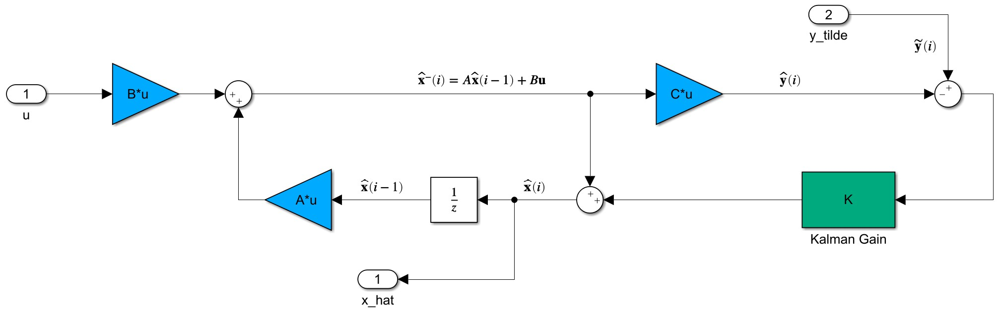
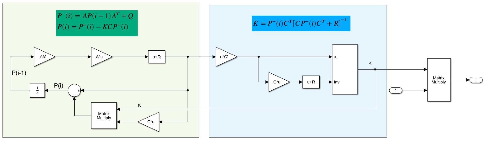
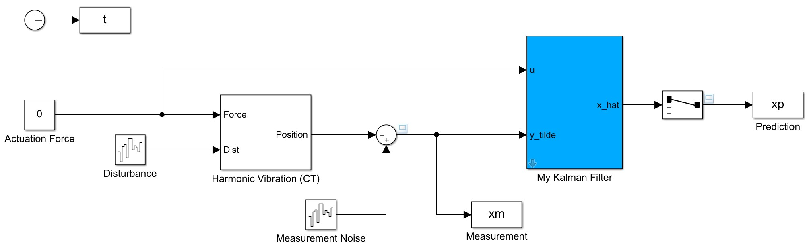
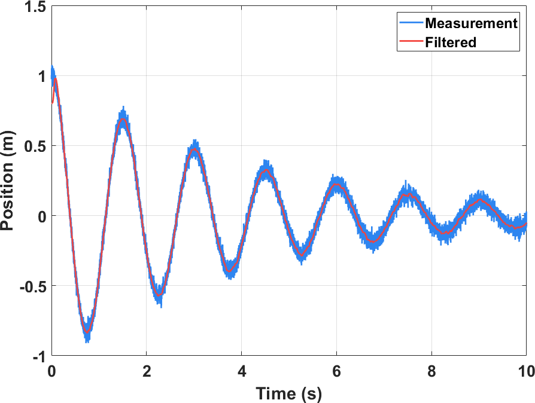

卡尔曼滤波器是一种时域的自回归滤波器，能够根据系统的输入输出从噪声中提取状态信息，并以其高效的递归特性广泛应用于航空航天等领域。本文参考文献[Understanding the Basis of the Kalman Filter Via a Simple and Intuitive Derivation](https://ieeexplore.ieee.org/document/6279585)，旨在简要介绍卡尔曼滤波的基本原理。

# 从一个例子说起

假设有一天开车出去玩，想时时刻刻知道所处的位置以避免迷路，可以采用两种方式获得当前的位置信息：

1. 利用GPS获取当前位置，这是直接的测量手段，但存在测量误差；
2. 根据车速表对速度进行积分，结合确定的初始位置来确定当前位置，但会受到车速表误差的影响。

由于这两种方法都存在误差，于是会想到取两者的平均值来作为当前位置的最佳估计。进一步，想到平均值也分为算数平均值、加权平均值、几何平均值等，选用哪种平均值较好呢？由于两种方法的误差不一定相同，所以会优先选用加权平均值，并且考虑到方差越大表示测量越不准确，那么应当以方差的倒数为权。

实际上，这就是卡尔曼滤波的基本思想：根据系统的输入和已知的数学模型对输出进行**预测**，然后根据实测的输出进行某种加权平均对状态进行**更新**，从而实现最佳状态估计。

# 卡尔曼滤波算法

下面我们尝试推导卡尔曼滤波的递归算法，需要说明的是，本文以类比的方式引导读者对卡尔曼滤波产生更加直观的认识，因而部分数学推导并不严谨。

## 预测

卡尔曼滤波采用后向差分的离散状态空间，将实际系统表述为：
$$
\left\{ \begin{array}{l}
{\bf{x}}(i) = A{\bf{x}}(i - 1) + Bu(i) + {\bf{w}}(i)\\
y(i) = C{\bf{x}}(i) + Du(i) + v(i)
\end{array} \right.
$$

其中，$\mathbf{x}$为系统的状态变量，$u$为系统输入，相应$B$称为输入矩阵；$y$为系统输出，$C$为输出矩阵；本文假设系统的直接传输矩阵$D=0$；同时，假设系统的输入噪声$\mathbf{w}$和输出噪声$v$均服从零均值的高斯分布，其协方差矩阵分别记作$Q$和$R$。

由于噪声是不可预测的，当我们向系统输入$u$后，我们能够得到的状态估计值为：
$$
{{{\bf{\hat x}}}^ - }(i) = A{\bf{\hat x}}(i - 1) + Bu(i)
$$
这里，戴帽子的$\hat{\mathbf{x}}$表示优化后的状态估计值，加上负号上标的${{{\bf{\hat x}}}^ - }$表示直接由输入计算后待修正的状态。

依据开头例子的思想，可以利用初步预测状态的协方差矩阵对状态进行修正，因此还需要考察协方差矩阵的动态。设${{{\bf{\hat x}}}^ - }$的协方差矩阵为$P^{-}$，根据协方差矩阵的定义，有：
$$
\begin{array}{l}
{P^ - }(i) &=& E\left[ {\left( {{\bf{x}}(i) - {{{\bf{\hat x}}}^ - }(i)} \right){{\left( {{\bf{x}}(i) - {{{\bf{\hat x}}}^ - }(i)} \right)}^T}} \right]\\
 &=& E\left[ {\left( {A{\bf{x}}(i - 1) - A{\bf{\hat x}}(i - 1) + {\bf{w}}(i)} \right){{\left( {A{\bf{x}}(i - 1) - A{\bf{\hat x}}(i - 1) + {\bf{w}}(i)} \right)}^T}} \right]\\
 &=& AE\left[ {\left( {{\bf{x}}(i - 1) - {\bf{\hat x}}(i - 1)} \right){{\left( {{\bf{x}}(i - 1) - {\bf{\hat x}}(i - 1)} \right)}^T}} \right]{A^T}\\
& &+ AE\left[ {\left( {{\bf{x}}(i - 1) - {\bf{\hat x}}(i - 1)} \right){\bf{w}}{{(i)}^T}} \right]\\
& &+ E\left[ {{\bf{w}}(i){{\left( {{\bf{x}}(i - 1) - {\bf{\hat x}}(i - 1)} \right)}^T}} \right]{A^T}\\
& &+ E\left( {{\bf{w}}(i){\bf{w}}{{(i)}^T}} \right)\\
&=& AP(i - 1){A^T} + Q
\end{array}
$$
其中用到了零均值噪声的假设，使得
$$
AE\left[ {\left( {{\bf{x}}(i - 1) - {\bf{\hat x}}(i - 1)} \right){\bf{w}}{{(i)}^T}} \right] = E\left[ {{\bf{w}}(i){{\left( {{\bf{x}}(i - 1) - {\bf{\hat x}}(i - 1)} \right)}^T}} \right]{A^T} = 0
$$
至此完成了状态量和协方差的初步预测。

## 更新

为了对状态量进行更新，假设模型预测的输出$\hat{y}^{-}=C\hat{\mathbf{x}}^{-}$以及测得的输出$\tilde{y}$分别服从高斯分布：
$$
\left\{ {\begin{array}{*{20}{l}}
{{{\hat y}^ - } \sim N({\mu _1},\sigma _1^2) \Rightarrow {f_1} = \frac{1}{{\sqrt {2\pi \sigma _1^2} }}{e^{ - \frac{{{{(y - {\mu _1})}^2}}}{{2\sigma _1^2}}}}}\\
{\tilde y \sim N({\mu _2},\sigma _2^2) \Rightarrow {f_2} = \frac{1}{{\sqrt {2\pi \sigma _2^2} }}{e^{ - \frac{{{{(y - {\mu _2})}^2}}}{{2\sigma _2^2}}}}}
\end{array}} \right.
$$
对输出的最好估计就是两者的联合分布，这只需要将概率密度函数相乘即可。对于独立高斯分布的随机变量，其联合分布依然是高斯分布，忽略概率密度函数的归一化系数，联合密度函数的核为：
$$
{f_1}{f_2} \propto {e^{ - \left[ {\frac{{{{(y - {\mu _1})}^2}}}{{2\sigma _1^2}} + \frac{{{{(y - {\mu _2})}^2}}}{{2\sigma _2^2}}} \right]}} \propto {e^{ - \frac{{{{(y - {\mu _{fused}})}^2}}}{{2\sigma _{fused}^2}}}}
$$
将指数对应后可以得到融合后的均值$\mu_{fused}$和方差$\sigma_{fused}^2$分别为：
$$
\left\{ \begin{array}{l}
{\mu _{fused}} = \frac{{{\mu _1}\sigma _2^2 + {\mu _2}\sigma _1^2}}{{\sigma _1^2 + \sigma _2^2}} = {\mu _1} - \frac{{\sigma _1^2}}{{\sigma _1^2 + \sigma _2^2}}\left( {{\mu _2} - {\mu _1}} \right)\\
\sigma _{fused}^2 = \frac{{\sigma _1^2\sigma _2^2}}{{\sigma _1^2 + \sigma _2^2}} = \sigma _1^2 - \frac{{\sigma _1^2}}{{\sigma _1^2 + \sigma _2^2}}\sigma _1^2
\end{array} \right.
$$
用协方差矩阵来替换上式，即：
$$
\left\{ {\begin{array}{*{20}{l}}
{{\mu _1} \to C{{{\bf{\hat x}}}^ - }(i)}\\
{{\mu _2} \to {\bf{\tilde y}}(i)}\\
{{\mu _{fused}} \to C{\bf{\hat x}}(i)}\\
{\sigma _1^2 \to C{P^ - }(i){C^T}}\\
{\sigma _2^2 \to R}\\
{\sigma _{fused}^2 \to CP(i){C^T}}
\end{array}} \right.
$$
替换后可得：
$$
\left\{ \begin{array}{l}
{\mu _{fused}} \to C{\bf{\hat x}}(i) = C{{{\bf{\hat x}}}^ - }(i) - C{P^ - }(i){C^T}{\left[ {C{P^ - }(i){C^T} + R} \right]^{ - 1}}\left( {\tilde y(i) - C{{{\bf{\hat x}}}^ - }(i)} \right)\\
\sigma _{fused}^2 \to CP(i){C^T} = C{P^ - }(i){C^T} - C{P^ - }(i){C^T}{\left[ {C{P^ - }(i){C^T} + R} \right]^{ - 1}}C{P^ - }(i){C^T}
\end{array} \right.
$$
将第一个式子两端同时左乘$C$的逆，在第二个式子两端同时左乘$C$的逆且右乘$C^T$的逆，得状态估计为：
$$
\left\{ \begin{array}{l}
{\bf{\hat x}}(i) = {{{\bf{\hat x}}}^ - }(i) - K\left( {{\bf{\tilde y}}(i) - C{{{\bf{\hat x}}}^ - }(i)} \right)\\
P(i) = {P^ - }(i) - KC{P^ - }(i)
\end{array} \right.
$$
其中${K = {P^ - }(i){C^T}{{\left[ {C{P^ - }(i){C^T} + R} \right]}^{ - 1}}}$称为卡尔曼增益。

## 小结

综上所述，卡尔曼滤波器可分为两个步骤，首先利用系统输入的信息对状态进行**预测**：
$$
\left\{ \begin{array}{l}
{{{\bf{\hat x}}}^ - }(i) = A{\bf{\hat x}}(i - 1) + Bu(i)\\
{P^ - }(i) = AP(i - 1){A^T} + Q
\end{array} \right.
$$
然后根据实测的输出对预测的状态进行**更新**：
$$
\left\{ {\begin{array}{*{20}{l}}
{{\bf{\hat x}}(i) = {{{\bf{\hat x}}}^ - }(i) - K\left( {{\bf{\tilde y}}(i) - C{{{\bf{\hat x}}}^ - }(i)} \right)}\\
{P(i) = {P^ - }(i) - KC{P^ - }(i)}\\
{K = {P^ - }(i){C^T}{{\left[ {C{P^ - }(i){C^T} + R} \right]}^{ - 1}}}
\end{array}} \right.
$$

# 仿真测试

构建带有阻尼的简谐振动系统，并设自振周期为1.5s，阻尼比为0.5，质量为1kg。仿真模型顶层设计如下图所示：

导入参数运行后，结果如下：

可见结合了输入信息后，卡尔曼滤波的结果降低了噪声的影响，使得估计值更加光滑。

该仿真模型托管在[GitHub](https://github.com/iChunyu/LearnKF)上，欢迎克隆、讨论！